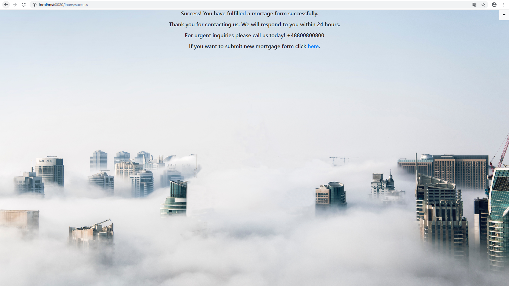

Mortgage Form
---------------------------------------------
Mortgage form is a banking application that supports the process of granting a mortgage credit.

---------------------------------------------
##### This project contains technologies:
- Spring Boot 2.1.8
- Java 11
- JPA + Hibernate
- MySQL 8.0.18
- Maven 3.6.1
- Thymeleaf 3
- Bootstrap 4
---------------------------------------------
##### Features:
- login authentication with access levels  
- fill out mortgage form  
- review the list of submitted forms  
- check details of selected form  
- update or delete submitted form  
- save current status of the form in db
--------------------------------------------
##### How to run application:

```bash
## Build application from base directory
mvn clean install

## Run initialization MySql scripts
initial-data-forms.sql
initial-data-users.sql

## Run Spring boot application
mvn spring-boot:run

```
---------------------------------------------
##### Screens:
The customer fills out the mortgage form. Form validation is supported.


Confirmation page after submitting the form.


A bank employee logs in (by Spring Security) to accept or reject the customer's request.


The status of the first row is empty because the bank employee has not accepted / rejected the form yet. 
To do this, the bank employee has to click the 'Update' button which takes him to the form confirmation page.


The bank employee can choose 'Accept' or 'Reject' from the drop-down list. He can also edit other fields in the customer's form.


The bank employee accepted the mortgage form and the status in the table is changed to 'Accepted'. The bank employee can complete the credit granting process.


If the form does not meet the bank requirements, it can also be rejected. Then status would be 'Rejected'. It can also be deleted by clicking 'Delete' button. Only manager role is authorised to use delete button.
